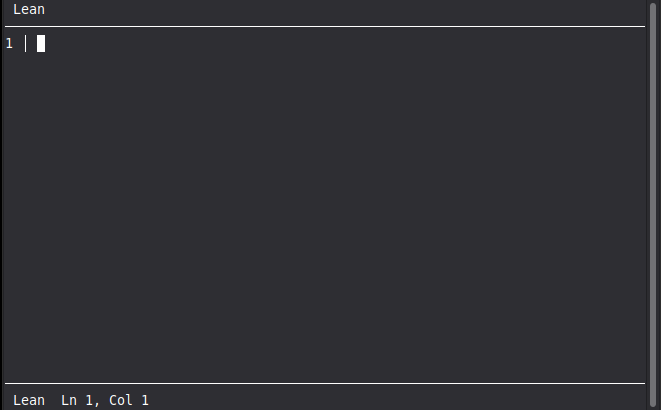
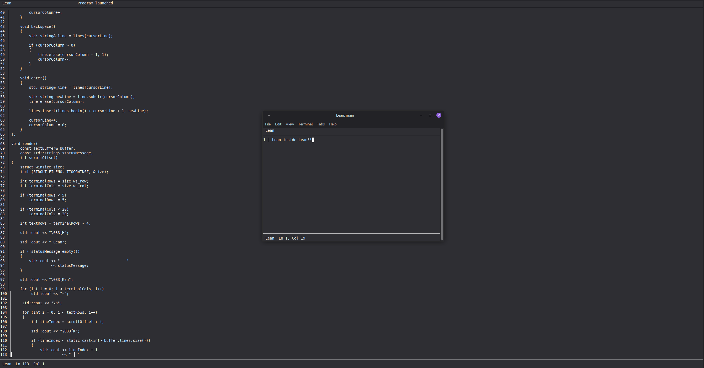
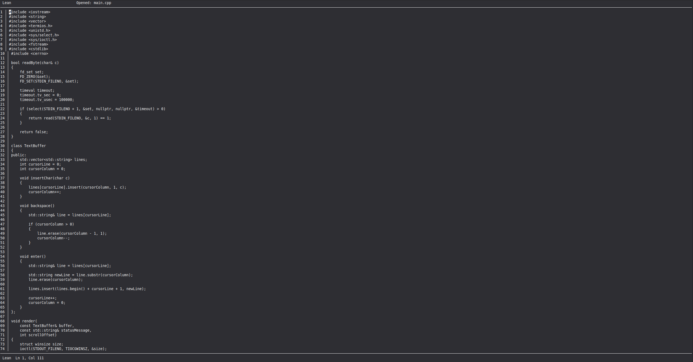

# Lean

> A lightweight terminal text editor written in C++.



Welcome to **Lean**!

Lean is a small, lightweight terminal-based text editor built from scratch in C++.

---

## Features

-  Edit text files
-  Open existing files
-  Save files
-  Scroll through documents
-  Navigate with the arrow keys
-  Build C++ programs
-  Run programs in a separate terminal
-  Line and column status bar

---

## Controls

| Shortcut | Action |
|---|---|
| `Ctrl + S` | Save |
| `Ctrl + B` | Build |
| `Ctrl + R` | Run |
| `Ctrl + End` | Exit |
| `Ctrl + Shift + C` | Copy |
| `Ctrl + Shift + V` | Paste |
| `Arrow Keys` | Navigate |
| `Backspace` | Delete |
| `Enter` | New line |

---

## Usage

### Open a file

```bash
./lean <file>
```
Example:
```
./lean test.cpp
```
### Save

Press:
```
Ctrl + S
```
If the file hasn't been saved before, Lean will ask for a filename.

Remember to include the file extension.

### Example:
```
hello.cpp
```
### Build

Press:
```
Ctrl + B
```
The file must be saved first.

Lean currently uses g++ to build C++ files.


### Run

Press:
```
Ctrl + R
```
The file must be saved and built first.

The program will open in a separate terminal window.

## Screenshots
Editor


Running




Coding




 
## Current Status

Lean is currently in its first release and is still evolving.

The current version focuses primarily on C++ development.

Future versions may add support for additional programming languages and more editor features.


### License

Lean is licensed under the Apache License 2.0.

Copyright © 2026 Emi.

See the LICENSE file for the full license.

### About

Developed by Emi.

emiowo.dev

Have an idea, suggestion, or feedback?

Feel free to get in touch trough my socials on my website!

Enjoy writing! :3

— Sincerely,
Emi
